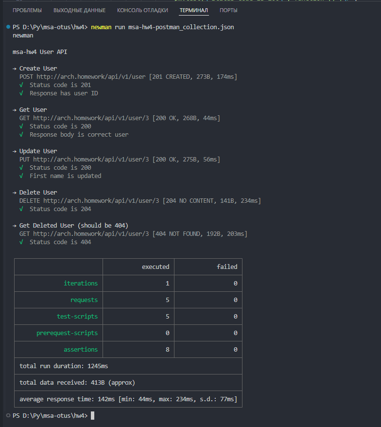

# MSA HW4 - User Service Application

Это приложение представляет собой простой RESTful CRUD сервис для управления пользователями, развертываемый в Kubernetes с использованием Helm.

## Предварительные требования

1.  **Docker Desktop**: Установленный и настроенный Docker Desktop с включенным Kubernetes.
2.  **kubectl**: Утилита командной строки для Kubernetes. Должна быть настроена для работы с Kubernetes в Docker Desktop.
3.  **Helm**: Пакетный менеджер для Kubernetes. Установите Helm v3+.
4.  **Git**: Система контроля версий Git (для клонирования репозитория).
5.  **Docker Hub Account**: Учетная запись на Docker Hub для скачивания Docker-образа (в данном примере используется `restwin/msa-hw4`).
6.  **Редактирование файла hosts (для локального тестирования Ingress)**: Возможность редактировать файл `/etc/hosts` (или `C:\Windows\System32\drivers\etc\hosts` для Windows) для добавления записи `127.0.0.1 arch.homework`.

## Структура проекта
```
msa-hw4/
├── app/                      # Исходный код Flask-приложения
├── k8s/                      # k8s вариант
├── msa-hw4-chart/            # Helm-чарт для приложения
├── Dockerfile                # Dockerfile для сборки образа приложения, как docker
└── README.md                 # Эта инструкция
```
## Шаги по развертыванию

### 1. Клонирование репозитория

Если вы еще не сделали этого, клонируйте репозиторий:
```bash
gh repo clone Restwin/msa-otus
cd hw4
cd msa-hw4
```

### 2. Установка приложения с помощью Helm
#### a. Перейдите в директорию Helm-чарта:
```bash
cd msa-hw4-chart
```
#### б. Обновление зависимостей Helm-чарта:
Эта команда загрузит чарты PostgreSQL и ingress-nginx в директорию charts/.
```bash
helm dependency update
```
#### в. Установка Helm-чарта:
Эта команда установит приложение, PostgreSQL и ingress-nginx (если он включен и еще не установлен) в неймспейс msa-hw4-ns.
На всякий случай, включен режим debug (можно убрать последний тег)

```Bash
helm install msa-hw4 msa-hw4-chart --namespace msa-hw4-ns --create-namespace --set image.tag=latest --wait --debug
```
В течение установки можно заметить несколько записей ожидания типа такого:
```Bash
ready.go:303: 2025-05-31 21:53:54.0821089 +0300 MSK m=+7.495189601 [debug] Deployment is not ready: msa-hw4-ns/msa-hw4-app-deployment. 0 out of 2 expected pods are ready
```
Это нормально, сделано для уверенности, что всё установится.
В конце установки будет содержимое Notes.txt

### 4. Проверка статуса развертывания
#### а. Проверьте все ресурсы в неймспейсе:

```Bash
kubectl get all -n msa-hw4-ns
```
Вы должны увидеть поды для приложения, PostgreSQL, Job миграций (может быть уже Completed), сервисы и Ingress.

#### б. Проверьте логи приложения:
Найдите имя пода %deployment% приложения (например, msa-hw4-app-deployment-xxxx-yyyy) и посмотрите его логи:

```Bash
kubectl logs -n msa-hw4-ns -l app.kubernetes.io/name=msa-hw4,app.kubernetes.io/component!=migrations -c msa-hw4-app-container --follow
```
(Эта команда будет следовать за логами основного приложения, исключая поды миграций)

#### в. Проверьте Ingress:
```Bash
kubectl get ingress -n msa-hw4-ns
```
Убедитесь, что Ingress msa-hw4-ingress создан и имеет адрес.
Внимание! Если у вас внешние сервера, не внутри компа, то в values.yaml нужно изменить service: type: LoadBalancer на ClusterIP

#### г. Проверьте события:
```Bash
kubectl get events -n msa-hw4-ns --sort-by='.metadata.creationTimestamp'
```

### 5. Доступ к приложению
Для доступа к приложению через Ingress по адресу http://arch.homework/, вам нужно настроить ваш локальный файл hosts.

Windows: C:\Windows\System32\drivers\etc\hosts
Linux/macOS: /etc/hosts
Добавьте следующую строку:
```
127.0.0.1   arch.homework
```
(IP-адрес 127.0.0.1 обычно работает для Ingress-контроллера в Docker Desktop, который пробрасывает порты 80/443 на хост).

### 6. Запустите тесты
Для того, чтобы проверить работу, можно проверить работу приложенияс помощью newman
```Bash
newman run msa-hw4-postman_collection.json
```
При успешном выполнеии будет следующая картинка:



### P.S.
Если что-то пошло не так, можно всё переустановить следующими командами:
```Bash
kubectl delete all --all -n msa-hw4-ns --ignore-not-found=true
helm uninstall msa-hw4 -n msa-hw4-ns --ignore-not-found=true
kubectl delete namespace msa-hw4-ns --ignore-not-found=true
kubectl create namespace msa-hw4-ns --dry-run=client -o yaml | kubectl apply -f -
helm install msa-hw4 msa-hw4-chart --namespace msa-hw4-ns --create-namespace --set image.tag=latest --wait --debug
```

